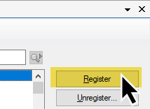

[Home](index.md) | [Templates](templates/index.md) | [Classes](classes/index.md)

# Clarion ProPath - Template Registration

When you run the installer, it will offer to automatically register the template during the installation process.  

If you decide not to allow that, or if you need to re-register the template at a later time, follow these steps:

In the Clarion IDE, click **Tools** and then **Edit Template Registry**.  

When the Template Registry window opens, click **Register**.  

When the Template File window opens, navigate to the **accessory\template\win** folder, select **PS_ProPathABC.tpl**, and click **Open**.  

If the template is successfully registered, you will see it in the list of installed and registered templates.  

**Note:** If you install or upgrade to a new version of Clarion, you may need to re-register **ProPath** in that version.

---

[Home](index.md) | [Templates](templates/index.md) | [Classes](classes/index.md)
