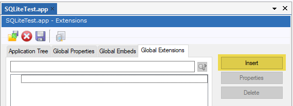
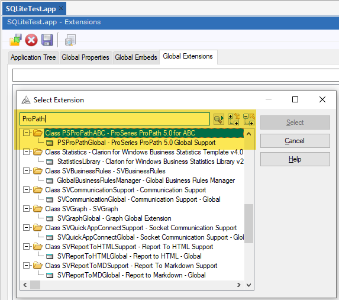
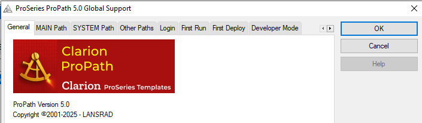

[Home](index.md) | [Templates](templates/index.md) | [Classes](classes/index.md)

# Clarion ProPath - Template Usage

To use **ProPath**, add the global extension template to your application.

On the **Global Extensions** tab, click the **Insert** button.  

Type **ProPath** in the search field, select the **PSProPathGlobal** template, and click the **Select** button.  

If the template is added successfully, you will see the **ProSeries ProPath 5.0 Global Support** extension.  

Use the template tabs and options to configure **ProPath** for your application.

Click the **OK** button to close the window. **ProPath** is now active and ready to manage your dataset and path configurations.  

---

[Home](index.md) | [Templates](templates/index.md) | [Classes](classes/index.md)
