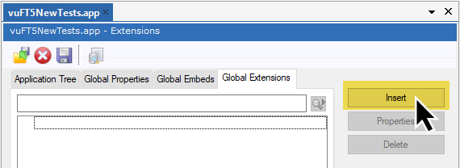
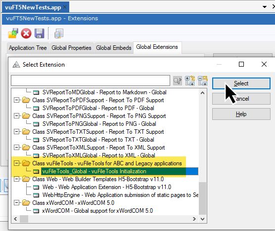
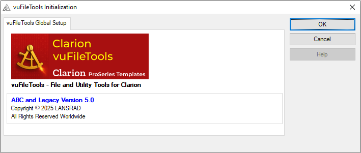

[Home](../index.md) | [All functions](functions/index.md) | [Categories](categories/index.md)

# vuFileTools - Template Usage

To use vuFileTools, add the global extension template to your application.

On the **Global Extensions** tab, click the **Insert** button.  

Type **vuFileTools** in the search field, select the **vuFileTools_Global** template, and click the **Select** button.  

If the template is added successfully, you will see the **vuFileTools Initialization** extension.  

Click the **OK** button to close the window. The entire library of vuFileTools functions is then ready for use in your application.  

**Note:** Be sure to include **vuFT5.dll** with your application deployment. Without the DLL, the functions will not be available at runtime.

[Home](../index.md) | [All functions](functions/index.md) | [Categories](categories/index.md)

